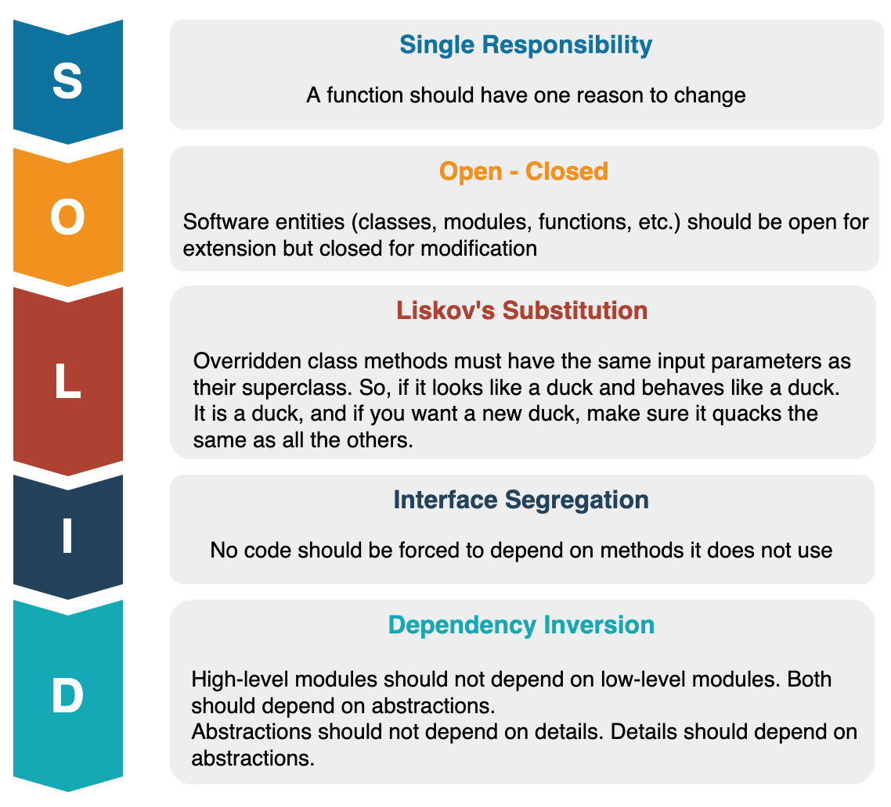

# AllTradeMx Tech Rules 📄

## 1. Project structure 🖥️

> [!IMPORTANT]
> 
> All source files should reside in a src/ directory, and all test files should be in a tests/ directory. (we will use this folder structure for any project, cause this is an scalable solution), also we need to include other folders like, data, domain, etc. in the root of the project, you can see an example of this in every project our github repos.

### Directory layout and file organization:
> ![e.g][2]

## 2. Error Handling:
>[!IMPORTANT]
>
>For a better optimization when dealing an error, please follow the correct guidelines to report the errors on the application.

- Use try-catch blocks for synchronous code and .catch() for promises.
- Use the throw keyword for custom errors and always propagate them to a central error handler.
- Use consistent and meaningful error codes.
- Handle errors with grace and provide feedback.
- Use a logging framework or library (we are using [Rollbar](https://rollbar.com))

## 3. Logging

>[!NOTE]
>
> Always log API requests, database operations, and error messages.

In this case, you should implement the following logging library called [Rollbar](https://rollbar.com) to log all API requests, database operations and error messages to make a registry of them.

### Log levels (debug, info, warning, error):

> Use log levels to specify:

| 💻: DEBUG           |
|:----------------------------|
| Internal system details   |

| ℹ️ INFO               |
|:----------------------------|
| Successful operations |

| :warning: WARNING           |
|:----------------------------|
| Another way to warn you     |

| :boom: ERROR               |
|:----------------------------|
| Critical failures

## 4. Version Control
>[!TIP]
>
>You need to follow all the requirements in the documentation to be able to send pull requests and make it possible to be approved by the team.
### Branch strategy

We
used [Trunk-based development (TBD)](https://launchdarkly.com/blog/introduction-to-trunk-based-development/)
as the branching strategy.

![e.g][1]

The idea of this strategy is that all developers integrate their changes directly to a shared trunk
every day (in our case, our `main` branch), a shared trunk that is always in a releasable state. No
matter what a developer might do on their local repository, at least once each day, they must
integrate their code. This practice forces each developer to regularly see and react to the changes
being made by their teammates in version control, which drives collaboration around the quality and
state of the codebase as a near-constant activity.

### Branch Naming

In order to have a great administration with our branches, we have established a convention that
will allow us to identify them more quickly, the structure is as follows:

    type/username/clickup-ticket/short-description

Where

- `type`: The type of contribution you are about to make, we have at least 4.
    - `core`: Important changes to the project, an update in some fundamental part of the
      application, change in some configuration or addition of a specific library.
    - `feature`: Any new development that adds functionality to the project.
    - `fix`: The solution to a bug.
    - `release`: When bumping the `versionCode` and the `versionName` for the signature of a
      productive build.
- `username`: Your GitHub username.
- `short-description`: A brief description separated by `-` that help us to identify the objective
  of this branch.

**e.g.**

    feature/mariodev-at/Cu-123456/add-new-feature

### Commit message formats

Use the format: <code style="background-color: #262626; color: #ec4899; padding: 4px; border-radius: 5px;"> [type]: [short description]</code>. For instance, <code style="background-color: #262626; color: #ec4899; padding: 4px; border-radius: 5px;">Fix: resolve login bug.</code>

### Merge vs. Rebase
- Use merge for combining features into the main branch and rebase to keep feature branches up-to-date with the main branch.
- Always pull the latest changes before rebasing and resolve conflicts locally.

## 5. Clean Architecture.
>[!WARNING]
>
> Without this knowledge you can create new features for the project

> We implement the following architecture into our projects [Clean Architecture](https://blog.cleancoder.com/uncle-bob/2012/08/13/the-clean-architecture.html)

## 6. Solid principles.

>[!WARNING]
>
> Without this principles you can create new features for the project

> We follow the following best practices for code creation. [SOLID PRINCIPLES](https://www.baeldung.com/solid-principles)

[1]: ../images/trunnkbasedevelopment.png
[2]: ../images/tree.png
